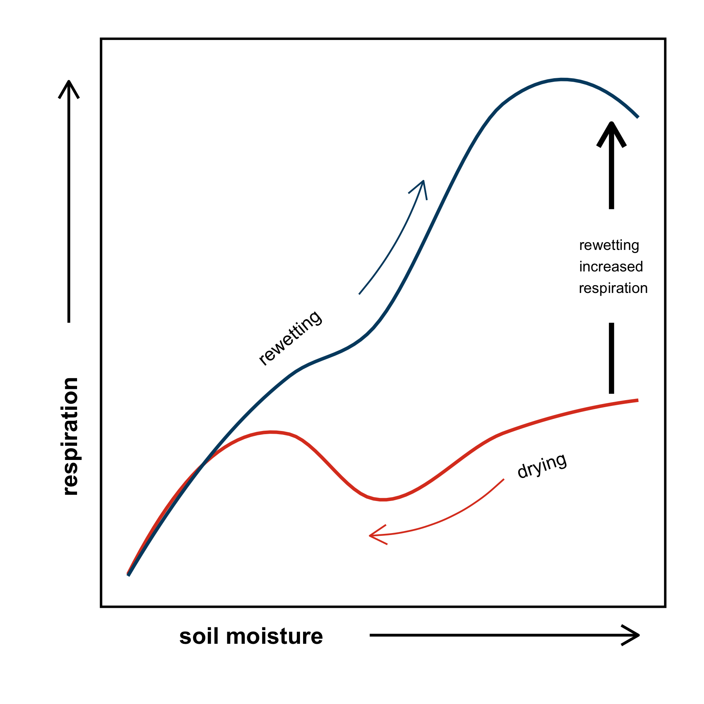
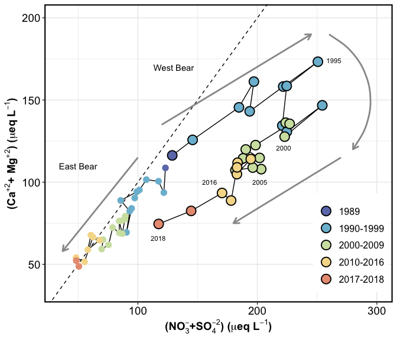

```{css, echo=FALSE}
.myMinion {
 width: 30%;
 float: right;
  padding: 50px;
  clip-path: ellipse;
 background: orange;
}


.left {
  width: 30%;
float: left;
 padding: 0 20px 20px 0;
}


.right {
 float: right;
 padding: 0 0 20px 20px;
}

```

### Soil carbon and water dynamics

::::: {style="display: flex; justify-content: space-between;"}

::: {style="flex: 1;"}


Soil moisture is an important driver of soil carbon fluxes, and drying-rewetting events influence C stabilization in soils. Drought events are increasing in intensity and frequency, and it is therefore crucial to understand soil C fate and transport as a soil dries and is subsequently rewet.

:::

::: {style="flex: 1;"}

```{r, fig.align='right', out.width='90%', echo=FALSE}


```

:::

:::::

------------------------------------------------------------------------

### Nitrogen saturation in northeastern USA forests: <br> The Bear Brook Watershed in Maine

::::: {style="display: flex;"}

::: {style="flex: 1;"}

```{r, fig.align='left', out.width='80%', echo=FALSE, fig.width=8}

```

:::


::: {style="flex: 1; font-size: 90%"}
The BBWM is one of the longest running forested watershed manipulations studying the effects of chronic nitrogen and sulfur enrichment and environmental change on forest ecosystem processes. Over the last three decades, research has been conducted on soil, stream, and vegetation response to changes in the physical and chemical environment. Current research is focusing on understanding the biotic and abiotic character of recovery to acidification in a changing climate.

:::

:::::

------------------------------------------------------------------------

### Changing winters in the northeastern USA

::::: {style="display: flex;"}

::: {style="flex: 1;"}

Global environmental change in northeastern North America is resulting in warmer winters with reduced snow accumulation. Soils under a thin snowpack are more likely to experience freeze--thaw cycles, disrupting carbon and nitrogen transformations. There has also been a significant decline in the duration of winter, the number of snow-covered days, and the timing of snowmelt. These projected changes in winter dynamics will likely have significant effects on soil biogeochemical processes, which extend beyond the snow- melt period.

:::


::: {style="flex: 1; font-size: 90%"}
```{r, fig.align='right', out.width='90%', echo=FALSE}
knitr::include_graphics("images/dbdf_snowremoval_2016.jpg")

```
:::

:::::